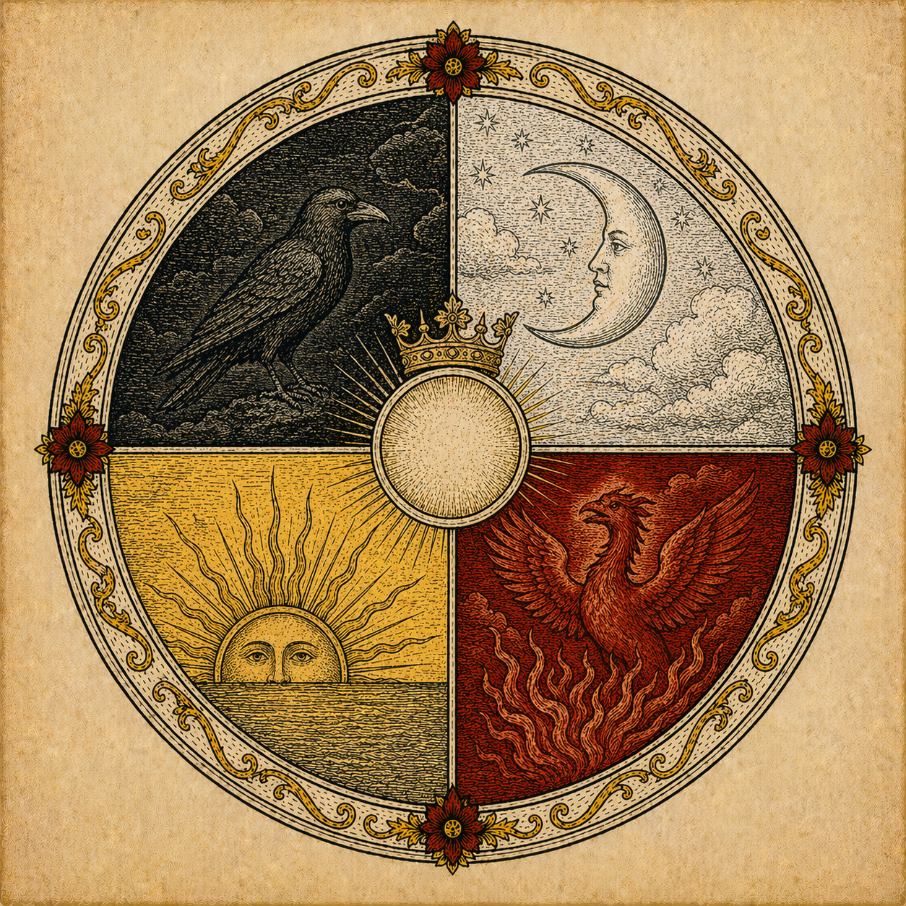
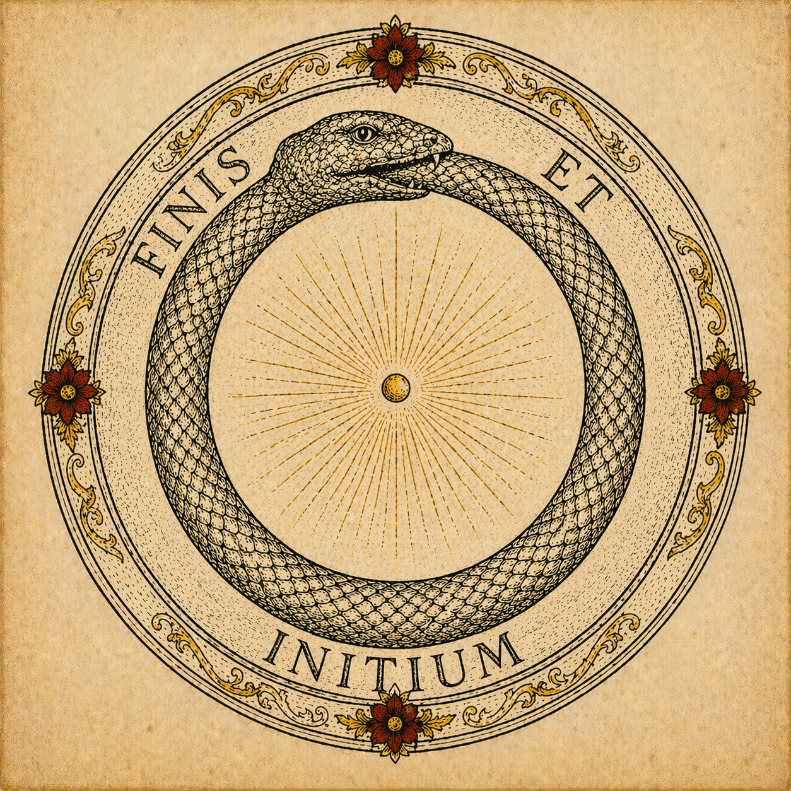

# Aurum Cordis

*Aurum Cordis* (“The Gold of the Heart”) is a static website that reads the alchemical **Opus Magnum** through three lenses at once: classical alchemy, orthodox Christian theology, and Jungian depth psychology.


## Why this project exists

Most modern summaries flatten alchemy into either chemistry history or esoteric mysticism. This project instead treats alchemy as a symbolic grammar for transformation and puts it in structured dialogue with:

- Patristic and classical Christian theology,
- Scriptural exegesis,
- Jung’s account of individuation and the unconscious.

The result is a long-form, chaptered reading experience designed for careful study rather than quick reference.

## What’s in the site

### Core sequence (the Great Work)

- **Foundations:** Prima Materia, Four Elements, Tria Prima, Seven Metals
- **Stages:** Nigredo, Albedo, Citrinitas, Rubedo
- **Synthesis:** Philosopher’s Stone, Opus Magnum
- **Context:** Jung & Alchemy, Bibliography

### Reference appendices

- **Cross-Reference Index** (`pages/cross-reference.html`): filterable theological/Jungian/scriptural index driven by JSON data.
- **Symbol Gallery** (`pages/symbol-gallery.html`): SVG symbol catalog with usage-friendly previews.



## Design and implementation

This is a **no-build** web project:

- HTML pages in `/` and `/pages`
- Shared styling in `css/base.css`, `css/components.css`, `css/animations.css`
- Per-page styling in `css/pages/`
- Lightweight vanilla JavaScript in `js/main.js`
- Content/data assets in `assets/` and `data/`

### Front-end behavior

The JavaScript layer provides:

- scroll-triggered reveal animations,
- smooth anchor scrolling,
- active nav highlighting,
- dropdown and mobile nav behavior,
- lazy background and image loading,
- optional page-specific interactions.

## Project structure

```text
aurum-cordis/
├── index.html
├── pages/
│   ├── prima-materia.html
│   ├── four-elements.html
│   ├── sulphur-mercury-salt.html
│   ├── seven-metals.html
│   ├── nigredo.html
│   ├── albedo.html
│   ├── citrinitas.html
│   ├── rubedo.html
│   ├── philosophers-stone.html
│   ├── opus-magnum.html
│   ├── jung.html
│   ├── bibliography.html
│   ├── cross-reference.html
│   └── symbol-gallery.html
├── css/
│   ├── base.css
│   ├── components.css
│   ├── animations.css
│   └── pages/
├── js/
│   ├── main.js
│   ├── diagrams.js
│   └── search.js
├── data/
│   └── cross-reference.json
└── assets/
    ├── icons/
    └── diagrams/
```

## Run locally

Because there is no build step, you can serve the project with any static file server.

### Python

```bash
python3 -m http.server 8000
```

Then open: <http://localhost:8000>

### Node (optional)

```bash
npx serve .
```

## Deploy

The repository is structured for straightforward GitHub Pages deployment:

1. Push to your GitHub repository.
2. Enable **Pages** in repo settings.
3. Set source to the default branch root.

## Using diagrams in documentation and pages

The `/assets/diagrams/` directory contains reusable thematic artwork suitable for:

- hero figures,
- chapter headers,
- README/documentation visuals,
- teaching materials.

Suggested highlights:

- `assets/diagrams/prima-materia.png`
- `assets/diagrams/nigredo.png`
- `assets/diagrams/albedo.png`
- `assets/diagrams/citrinitas.png`
- `assets/diagrams/rubedo-phoenix.png`
- `assets/diagrams/philosophers-stone.png`



## Editorial posture

This project is explicitly confessional and interpretive.

- It does **not** present all alchemical traditions as equivalent.
- It does **not** reduce theology to psychology.
- It does **not** claim historical alchemy was “secretly modern chemistry.”

Instead, it offers a comparative reading framework for symbolic theology, spiritual formation, and historical alchemical language.

## License

See [LICENSE](LICENSE).

---

*Ora et Labora et Lege*
